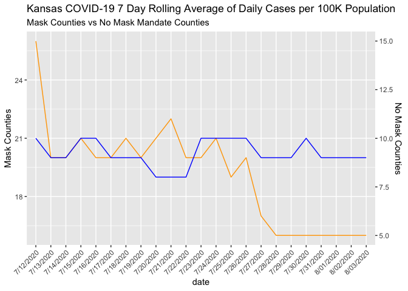

Lab 07 - Conveying the right message through visualisation
================
Elayna Seago
3/1/22

### Load packages and data

``` r
library(tidyverse) 
library(dplyr)
library(patchwork)
```

### Exercise 1

``` r
df <- tribble(
  ~date, ~mask_count, ~no_mask_count,
  "7/12/2020", 26, 10,
  "7/13/2020", 20, 9,
  "7/14/2020", 20, 9,
  "7/15/2020", 21, 10,
  "7/16/2020", 20, 10,
  "7/17/2020", 20, 9,
  "7/18/2020", 21, 9,
  "7/19/2020", 20, 9,
  "7/20/2020", 21, 8,
  "7/21/2020", 22, 8,
  "7/22/2020", 20, 8,
  "7/23/2020", 20, 10,
  "7/24/2020", 21, 10,
  "7/25/2020", 19, 10,
  "7/26/2020", 20, 10,
  "7/27/2020", 17, 9,
  "7/28/2020", 16, 9,
  "7/29/2020", 16, 9,
  "7/30/2020", 16, 10,
  "7/31/2020", 16, 9,
  "8/01/2020", 16, 9,
  "8/02/2020", 16, 9,
  "8/03/2020", 16, 9,
)
```

``` r
df %>% 
  mutate(mask_count = as.numeric(mask_count))
```

    ## # A tibble: 23 × 3
    ##    date      mask_count no_mask_count
    ##    <chr>          <dbl>         <dbl>
    ##  1 7/12/2020         26            10
    ##  2 7/13/2020         20             9
    ##  3 7/14/2020         20             9
    ##  4 7/15/2020         21            10
    ##  5 7/16/2020         20            10
    ##  6 7/17/2020         20             9
    ##  7 7/18/2020         21             9
    ##  8 7/19/2020         20             9
    ##  9 7/20/2020         21             8
    ## 10 7/21/2020         22             8
    ## # … with 13 more rows

I did not use decimals, so my graph does not look quite right, but I
think this is a rough replication. The main issue that makes this graph
misleading is that the two axes are not equal.

``` r
coeff <- 11
ggplot(df, aes(x=date)) +
  
  theme(axis.text.x = element_text(angle = 45, vjust = 1, hjust=1))+
  
  geom_line( aes(y=mask_count) , group = 1, colour = "orange") + 
  geom_line( aes(y=no_mask_count + coeff), group = 1 , colour = "blue") +
  
  scale_y_continuous(
    
    # Features of the first axis
    name = "Mask Counties",
    
    # Add a second axis and specify its features
    sec.axis = sec_axis(~.-coeff,name="No Mask Counties")
  ) +
  labs(title = "Kansas COVID-19 7 Day Rolling Average of Daily Cases per 100K Population" , subtitle = "Mask Counties vs No Mask Mandate Counties")
```

<!-- -->

### Exercise 2

``` r
#ggplot(df, aes(x=date))
```

Add exercise headings as needed.
